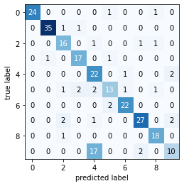

- **What is the performance (in terms of misclassification rate) that you obtain on training data, validation data, and testing data?**

Following I have added the best models achieved (based on several trials for each layer) in a single-layer, two-layer, three-layer, and four-layer neural networks. All the following were trained with a learning rate of 0.1.
The selected neural networks had the following structue:

- One-Layer : LinearLayer(784,10) 
- Two-Layer : LinearLayer(784,16) | LinearLayer(16,10)
- Three-Layer : LinearLayer(784,16) | LinearLayer(16,12) | LinearLayer(12,10)
- Four-Layer : LinearLayer(784,8)| LinearLayer(8,8) | LinearLayer(8,8) | LinearLayer(8,10)

All models were trained on Google Colab.
I should also mention due to RAM capaity models with more parameters could not be trained. 

| NN         |  1L   |  2L   | 3L      |      4L |
| ----------- | ---- | ------| ------- | ------- | 
| training   | 0     |  34.3 | 23.1 | 70.0|
| validation | 0.16  | 38.1 | 27.1 | 76.1|
| test        | 0.17 | 37.2 | 28.3 | 70.2 |
| Number of nodes| 7,840 | 12,704 | 12,856 | 6,480 |
|Epoch Time(s)| ~70s | ~100s| ~105s | ~ 55s |

Different learning rates were also tried, you can see the train/validation accuracy based on different learning rates for the one layer NN: 

- lr=0.01 

- lr=0.1 

- lr=0.5

Based on these results it seems a learning rate of 0.1 is good for this model. It achives better results and in fewer steps.

- **Do the architectures matter significantly in this case?**

Architecture matters. As you can see from the above table, Some architecture can get overfit on the training data fast, while other architecture might learn very slowly, and some do not learn very well.

- **What are the easy classes and hard classes? What classes tend to get confused with one another?**

Based on the following Confusion Matrix, we can see that predicting **9**'s as **4** is a common mistake made by this model: (this model is achieved from a one layer NN.)

However as we can see from the following this is not the case for all models, and some models can learn to tell the difference between **4** and **9** better. However, it is still the most incorrect label. This model have the same structure of the above model.

And some times **5** and **8** are mistaken, here is the Confusion Matrix on same model structure:

- **Attempt to the best of your ability to make your network overfit the training data. Can you? What architecture and training procedure achieves that?**

With a **single layer network** that takes image size input and outputs the number of classes and learning rate of 0.1. I was able to overfit the model after a few epochs. It was able to reach 100% accuracy on training data, and 87.2% on the validation.

| NN Accuracy |  1L   | 
| ----------- | ---- | 
| training   | 100%   |  
| validation |  85.2%  | 
| test        | 83.3% | 

- **Attempt to the best of your ability to make your network significantly underfit the training data. Can you? What architecture and training procedure achieves that? What does that say about this dataset?**

Underfitting was possible in following architectures:

- Three-layer with learning rate of 0.25 : LinearLayer(784,16) | LinearLayer(16,12) | LinearLayer(12,10)
- Two-layer with learning rate of 0.1 : LinearLayer(784,2) |  LinearLayer(2,10)

| NN Accuracy |  3L   | 2L |
| ----------- | ---- | ---- | 
| training   | 11.80%   |   27.80% |
| validation |  12.40%  | 29.20% |
| test        | 11.50% |  27.20% |

Following is the Confusion Matrix for the 2L NN. Since there are only two nodes in the middle layer of the NN, I think it cannot represent all the inputs, that is why it can only predict 2 or 3 labels correctly:

