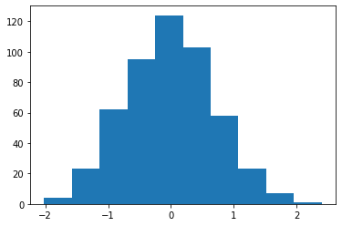
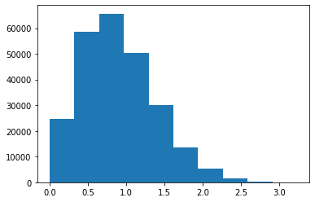
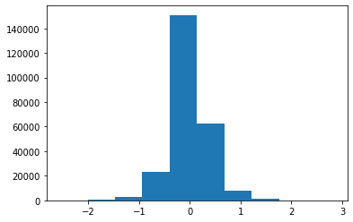
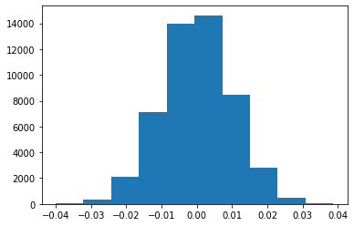
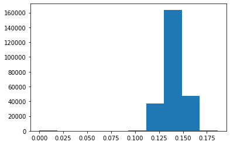
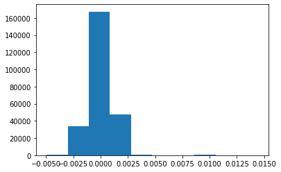

**1. What’s the best validation accuracy you obtain on agaricus-lepiota and on primary-tumor by experimenting with k? How does this compare to your decision tree classifier?**

**a) agaricus-lepiota:**

We were able to get to the best result with a smaller k. The model was able to achieve 100%. In the Decision tree, the same results were achieved with a depth equal and greater than 4. However, the Decision Tree performs very faster for this larger dataset.

| **agaricus-lepiota**|KNN|Decision tree | 
| ----------- | -------|------- |
| Training    |**100%**|**100%**|
| Validation: |**100%**|**100%**|
| Testing:    |**100%**|**100%**| 

**b) primary-tumor:**

By expierencing with k, the best results for validation was 49.41% (with k=14), which gave 42.35% for the testing set. For the Decision tree, the best results were given with depth 7, with validation accuracy of 42.35%. For this dataset, it seems the KNN worked better.

| **primary-tumor**|KNN|Decision tree | 
| ----------- | -------|-------|
| Training    | 46.75%| 81.07%|
| Validation: | **49.41%**| 42.35%|
| Testing:    | 42.35%|  40.00%|

**2. As you increase the hyperparameter k, what happens to each of the training and validation accuracies, and why? Explain, specifically, the training accuracy you obtain with k=1 for the primary-tumor dataset.**

In the following tables, you can view the accuracies obtained by each dataset as we increase k. As we can see when k is small it overfits on the training dataset, because it only sees the closest data point to the training which is itself. This works well on the *agaricus-lepiota* dataset since there are only two labels it seems to work fine. As k is increased, it better generalizes the dataset. However, for larger k, it tends to only predict the more common labels.

| **agaricus-lepiota**|K=1|k=3  | k=5   | k=12  | k=88  | k=145| k=280  |k=1000|
| ----------- | -------|------- |-------|-------|-------|-------|-------|------|
| Training    |**100%**|**100%**| 99.95%| 99.95%| 98.62%| 97.10%| 94.88%|88.75%|
| Validation: |**100%**|**100%**| 99.90%| 99.85%| 97.88%| 96.70%| 94.78%|89.02%|
| Testing:    |**100%**|**100%**| 99.90%| 99.85%| 98.52%| 97.14%| 94.93%|88.58%|
| Time (s):   | 1685   |  1892  | 1631  |  1875 | 1626  |  1620 |  1700 | 1756 |

k=1 and 3 were the best-selected models on the validation set, (using a random search for 10 k, between 1 and len(train)/100. and 3 random searches for k between 1 and 10). It also had the best results for the test as well.

| **primary-tumor**| K=1 | k=2 | k=3   | k=5   | k=10  | *k=14*| k=20  |
| ----------- | -------|-------|-------|-------|-------|-------|-------|
| Training    |**94.67%**| 56.21%| 55.62%| 47.34%| 48.52%| 46.75%| 44.97%|
| Validation: | 34.12% | 31.76%| 32.94%| 41.18%| 47.06%| **49.41%**| 43.53%|
| Testing:    | 27.06% | 34.12%| 38.82%| **44.71%**| 38.82%| 42.35%| 41.18%|

k=14 was the best-selected model on the validation set, (using a random search for 10 k, between 1 and len(train)/100. However, as shown in the table the best Testing performance was for k=5.

**3. Describe the performance (in terms of runtime) of your kNN classifier.**

The time complexity, for N samples in D dimensions the running time complexity turns out to be O(DN2) (for the testing size of M it will be O(DMN).) If we have a small number of dimensions and training sets, this would run in a reasonable time. But as the training set size increases, the running time grows quickly (which we saw in our datasets)

for our model it took on average around 1700(s) to give results for the *agaricus-lepiota* data set and more than 1(s) for the *primary-tumor* dataset, which is a much smaller dataset.

**4. Generate 500 samples from a 2-dimensional multivariate normal with mean zero and total variance 1 (that is, each dimension should have variance 0.5).
Generate 500 samples from a 100-dimensional multivariate normal with mean zero and total variance 1 (that is, each dimension should have variance 0.01). Plot a histogram of its lengths, and a histogram of the distances between all pairs.
For each of the two datasets you generated above, plot:
a histogram of the lengths of the samples
a histogram of the distances between all pairs
a histogram of the inner products between all pairs
Given these observations:
what can you say about the behavior of multiple unit-variance Gaussians in large dimensions?
what can you say about the behavior of kNN classifiers in large dimensions?**

Following are the plots for the 2-dimensional sample: (the same order as the problem question)

Following are the plots for the 100-dimensional sample: (the same order as the problem question)

We can see that the inner products of all pairs are very close to 0, and random angles are all square! ( or as mentioned in the book EVERYONE LIVES NEAR THE EQUATOR). 

As we can see since all the distances are close to each other for the 100-dimensional problem, all the pair distances are almost the same. Therefore, picking “the close-by values” is almost impossible, and we cannot separate classes using the kNN classifiers. 

**5. Use the script dr.py to construct lower-dimensional versions of agaricus-lepiota and primary-tumor, then run your kNN classifier on a variety of settings for k. Experiment with varying numbers of d as well. What do you find? What are the tradeoffs here?**

Using grid random search the following results were achieved: (the dimension for the original dataset is 42)

| **primary-tumor**|K=2,d=23|k=5,d=10|k=6,d=41|k=7,d=13|k=7,d=21|k=10,d=7|k=11,d=28|k=15,d=13|k=15,d=38|
| ----------- | -------|-------      |-------|-------  |-------|-------|-------    |-------|-------|
| Training    |**57.99%**|  47.34%|    49.11%| 55.03%  | 48.52%| 43.79%| 46.15%    |42.01%| 44.97% |
| Validation: | 36.47% | 34.12%   |**47.06%**| 44.71%  | 38.82%| 35.29%| 41.18%    | 37.65%| 36.47%|
| Testing:    | 30.59% | 35.29%   |    36.47%|   36.47%| 35.29%| 36.47%| **41.18%**| 38.82%| 38.82%|

As shown in the table above, it shows that dimension reduction blow 10 usually didn't work great, however, reducing the dimensionality to 50% worked fine.

| **agaricus-lepiota**|k=1,d=1|k=1,d=6  |k=1,d=17|K=4,d=14|k=8,d=9|k=20,d=11|k=20,d=11|k=22,d=32|k=26,d=25|k=38,d=22|
| -----------        |------- |-------  |-------| ------- |-------|-------  |-------  |-------  |-------  |  -------|
| Training           | 100.00%|100.00%  |100.00%|100.00%  |99.14% |   98.50%| 98.50%  | 99.83%  | 99.85%  |   99.58%|
| Validation:        | 57.51% | 93.85%  |100.00%| 99.95%  |98.62% |97.98%   | 97.98%  | 99.56%  | 99.85%  |   99.21%|
| Testing:           | 59.58% |  94.34% |100.00%| 100.00% | 98.97%|  98.13% |  98.13% |   99.75%| 99.75%  |   99.56%|

For the *agaricus-lepiota* dataset, the dimension is 117. As shown above, if we keep the k low, we can achieve the highest rating when decreasing the dimensionality to around 10% of the original size. This reduces the time complexity of the problem as well. (from 1800(s) to solve the problem to around 100(s))

**6.Given the results you found in 5, would it ever be useful to reduce the dimensionality of primary-tumor, if you could have a well-principled way of doing it?**

It almost achieved as good as using the same dimensionality. Since the dataset is small, the reduction doesn't decrease the time a lot, so maybe if we had a bigger dataset (or a dataset with more dimensions) this would be a good idea, but for this problem, dimensionality reduction does not seem to have a logical explanation.

