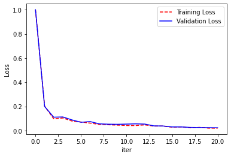

### REGRESSION UNDER QUADRATIC LOSS

**Implement a gradient descent procedure to minimize the quadratic loss with an l2
 regularizer. Stop your gradient descent procedure when the squared norm of the gradient goes below 10-4.**

1. **Run the classifier for the dataset regression-dataset.pickle under the following regularization values: λ=0,0.0001,0.01. You might have to experiment with the learning rate for the algorithm to converge. What are the validation and training losses you obtain?**

| REGRESSION |  l2=0.01 | l2=0.0001| l2=0 |
| ----------- | ---- | ------| ------- | 
| iter_num   | 937 |  993 | 993 |
| train_loss | 0.04| 0.03 | 0.03 |
| val_loss   | 2.39| 2.50 | 2.51 |

And here is the plot for the l2=0.01 and leaning rate = 0.01.

2. **Design a procedure for early stopping, based on monitoring the validation error. What are the accuracies you obtain for the regularization values above? Discuss.**

Adding the early stopping, the model achieves the okay results as soon as 5 steps. However, the problem is that it would not reach the global minimum that we can see from the above plot. To achieve that we have to add a delay to our early stopping. In this delayed model it will check if the validation loss is getting bigger than 100 steps before it. This delay helps us achieve the best result. In practice, we have to save weights for the previous model so we can pick the one with the lowest val-loss.

| REGRESSION | with l2=0.01  | with ES step=3 | with ES step=100 |
| ----------- | ---- | ------| ------- |
| iter_num   | 937 |     5 | 173 |
| train_loss | 0.04| 0.90 | 0.07 |
| val_loss   | 2.39| 0.73 | 0.34 |

**Note that it might be easier to store a list of the losses and plot the loss curve over time in order to see what’s happening.**

### CLASSIFICATION UNDER LOGISTIC LOSS

**Implement a gradient descent optimization procedure to find a classifier that minimizes the logistic loss function with an l2 regularizer. Stop your gradient descent procedure when the quadratic norm of the gradient goes below 10-4.**

1. **Run the classifier for the `agaricus-lepiota` dataset under the same regularization values as above. You might have to experiment with the learning rate for the algorithm to converge. What are the validation and training losses you obtain?**

The following are the results achieved with the learning rate of 0.1 and regularization of 0.1. This model ran for 326 iterations to achieve the quadratic norm of the gradient of below 10-4.

|Logestic|accuracy|
|-------|-----|
|  Training:   | 93.08%|
|  Validation: | 92.76%|
|  Testing:    | 92.66%|

2. **Does early stopping help in this case?**

In this case early stopping works. After adding early stopping the following results were achieved. 

|Logestic|accuracy|
|-------|-----|
|  Training:   | 92.98%|
|  Validation: | 92.71%|
|  Testing:    | 92.71%|

As you can see the accuracy is similar, but we were able to obtain this accuracy after only 5 iterations (compared to 326 iterations without early stopping)

Here is the early stopping loss plot: 

### CLASSIFICATION UNDER HINGE LOSS

**Implement a gradient descent optimization procedure to find a classifier that minimizes the hinge loss function with an l2
regularizer. Stop your gradient descent procedure when the quadratic norm of the gradient goes below 10-4.**

1. **Run the classifier for the `agaricus-lepiota` dataset. Experiment with different regularization values. Which values produce more or fewer training points inside the margin? Which values produce better training or validation error?**

While experimenting with the regularization term, it did not show a huge diffrence on the results, following table shows the result of the experiment:

| Regularization | 0 | 0.001| 0.01 | 0.1 | 0.5 |
| ----------- | ---- |---- |---- |---- |---- |
| iter_num  | 25 | 25 | 25 | 32 | 25 |
| val_loss | 0.02| 0.02 | 0.03 | 0.02 |0.02 | 

And here is the accuracy of the model:

|SVM|accuracy|
|-------|-----|
|  Training:   | 99.11%|
|  Validation: | 98.92%|
|  Testing:    | 98.47%|

2. **Does early stopping help in this case?**

The early stopping would not help either because, for the SVM, the model is getting better after each iteration. This can be shown in the following plot:

