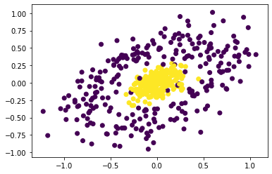

**1. After implementing the linear perceptron described in class, use it to create classifiers for the agaricus-lepiota and primary-tumor datasets.
Remember that primary-tumor has multiple classes, and that the perceptron algorithm only works on binary classifiers. The helper code now includes code (in Dataset.convert_labels_to_numerical) to convert multiple labels to a binary label.
Report the accuracy you get for all possible labels, and the influence of perceptron hyperparameters (number of passes) on training and validation/test accuracy. How do these numbers compare to the ones you’ve seen before? Explain.**

*You can use the `random_perceptron.py` to use a random grid search for each dataset.
Enter the code as follow: 
`random_perceptron.py DATASET number_of_itr_for_each_label k_random_range_start k_random_range_end`*

**a) agaricus-lepiota:**

For this dataset, the perceptron algorithm results were the same for both labels (since it is a binary dataset). The number of passes hyperparameter did not have any meaningful effect on the results, the results were the following: (this is the best-achieved result using a random grid with k = 6) 

| **agaricus-lepiota**|perceptron|
| ----------- | -------|
| Training    |**100%%**|
| Validation: |**100%**|
| Testing:    |**100%**| 

The results show that this dataset is linearly separable. 

**b) primary-tumor:**

For this dataset, the following results were achieved. Using a random grid for the number of passes hyperparameter showed that increasing the number generally improves the results, the following are the result for k=10000

| **primary-tumor** |l=1     | l=2   | l=3   | l=5   | l=7   | l=8   | l=11  | l=12  | l=2   | l=13  | l=14  | l=16| l=17 | l=18    | l=19   | l=20  | l=21| l=22  |
| -----------       | -------|-------|-------|-------|-------|-------|-------|-------|-------|-------|-------|-----|-----|    -------|-------|-------|-------|-------|
| Training          |93.49%  | 98.82%| 95.86%| 85.80%| 95.86%| 97.04%| 87.57%| 92.90%| 95.86%| 95.86%| 90.53%| 100%| 93.49%| 86.39% | 97.63%| 99.41%| 99.41%| 95.27%| 
| Validation:       | 80.00% | 94.12%| 97.65%| 85.88%| 92.94%| 98.82%| 92.94%| 96.47%| 97.65%| 97.65%| 89.41%| 100%| 95.29%| 88.24% | 94.12%| 98.82%| 100%  | 89.41%| 
| Testing:          | 84.71% | 98.82%| 98.82%| 81.18%| 94.12%| 96.47%| 89.41%| 92.94%| 98.82%| 98.82%| 96.47%| 100%| 90.59%| 88.24% | 96.47%| 100%  | 100%  | 89.41%|
| #label in training_set| 36|13|7|4|25|6|3|14|9|4|14|1|4|14|3|1|1|10|

As you can see the results did not do great on some of the labels with a larger number of labels. For the ones that have very few instances, the results are not reliable. (i.e. label 20 with only one sample)

**2. Run the perceptron classifier you wrote on mystery-dataset.pickle. What accuracy do you get? Do you get better accuracy with the decision trees or k-nearest-neighbor classifiers you’ve written before?
Improve the accuracy of the perceptron classifier by engineering better features for the perceptron to use. It should be possible for you to attain effective 100% accuracy on this classifier. Implement the method transform_features of MysteryTransform in perceptron-transform.py. Note that you will have to come up with a good feature transformation yourself, possibly by inspecting the training data and thinking hard.
What transformation did you implement, and what accuracy do you get?**

The data is balanced, meaning the number of each label is almost similar.

| **mystery-dataset**|k=2|k=1000|
| ----------- |-------|-------|
| Training    | 48.80%| 47.00%|
| Validation: | 50.00%| 47.20%|
| Testing:    | 53.60%| 45.80%|

This dataset shows that the data is not linearly separable.

For the KNN you can get around **98%** for all sets with k=5. For the decision tree since the feature space is not an integer, we have to change the code to the Gini method, which is outside of the scope of this homework. 

To understand the data a bit better, we fist polted the data on all posible pair of features: 

From the polts it can understand that the data is a sphere, so we take the absolute value. The following are the polts after taking the absolute value of all the features.

")
")
")

This shows that the data now can be linearly separable. Here is the results after the feature transform (for k=10000) 

| **mystery-dataset**|absolute|power=2|power=4    |power=6|power=6|
| ----------- |-------        |-------|-------    |-------|-------|
| Training    | 96.40%        | 97.40%| **97.80%**| 97.00%| 92.60%|
| Validation: | 96.40%        | 96.80%| **98.00%**| 96.00%|92.40% |
| Testing:    | 97.20%        | 97.60%| **98.40%**| 97.20%| 93.20%|

